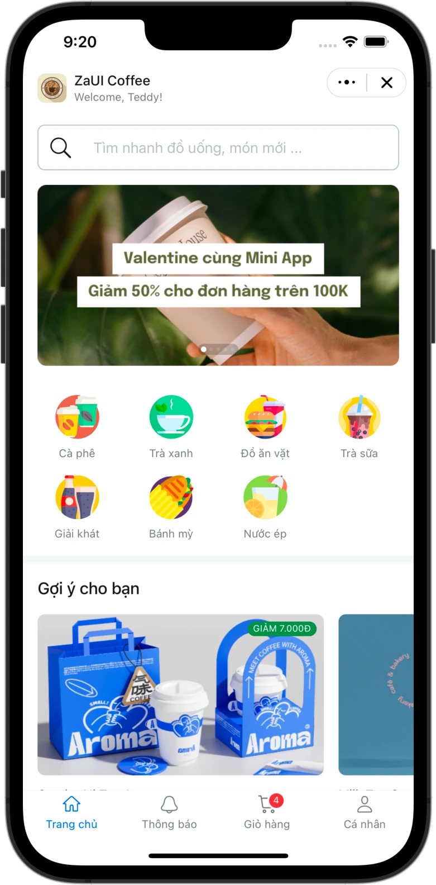
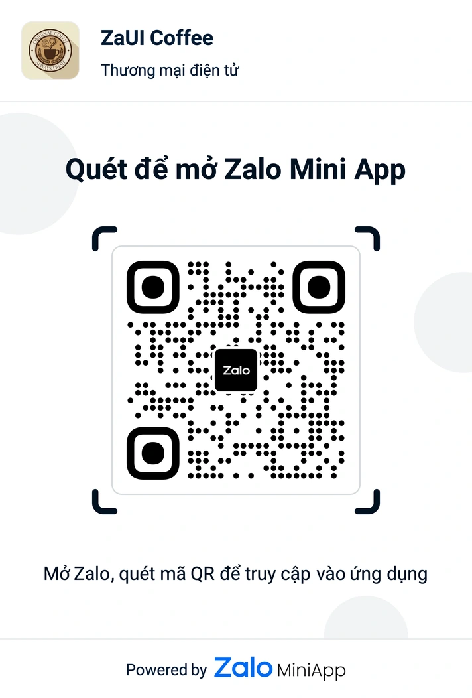
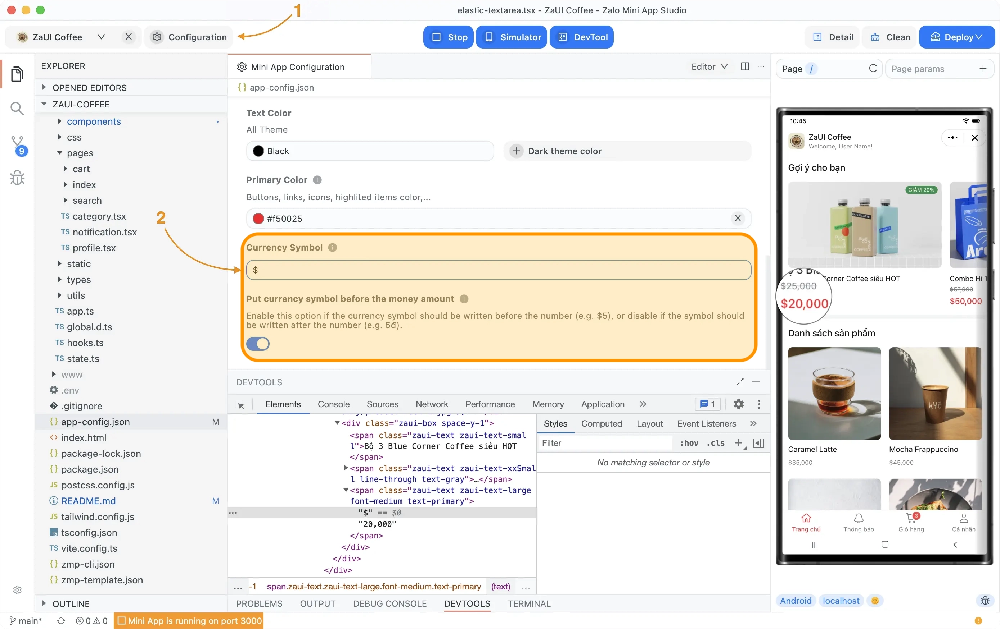
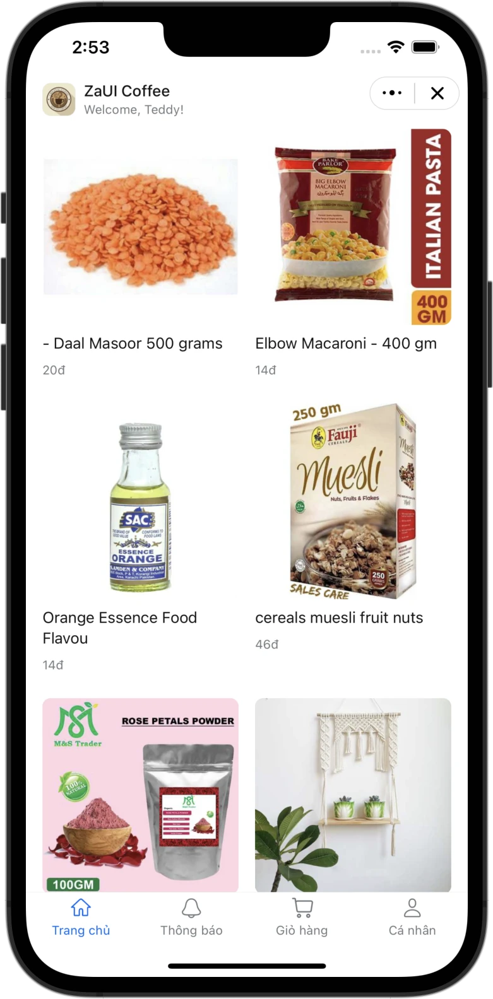

# Zalo Mini App - Loyalty Program

<p style="display: flex; flex-wrap: wrap; gap: 4px">
  
  
  
  
  
  
</p>

Ứng dụng loyalty program được xây dựng trên Zalo Mini App với tích hợp API thật. Các tính năng chính:

- Xem thông tin cá nhân và hạng thành viên
- Đổi và sử dụng voucher với điểm tích lũy
- Quét QR code để tích điểm
- Xem lịch sử giao dịch và voucher
- Quản lý chính sách thành viên và bảo mật
- Tích hợp hoàn toàn với API backend

|                      Demo                       |                  Entrypoint                  |
| :---------------------------------------------: | :------------------------------------------: |
|  |  |

## Setup

### Environment Configuration

1. Copy file `.env.example` thành `.env`:
   ```bash
   cp .env.example .env
   ```

2. Cập nhật các biến môi trường trong file `.env`:
   ```env
   VITE_API_BASE_URL=https://mini.alwaysdata.net/api/v1
   VITE_APP_ID=your_zalo_app_id_here
   VITE_SECRET_KEY=your_secret_key_here
   ```

### Using Zalo Mini App Extension

1. Install [Visual Studio Code](https://code.visualstudio.com/download) and [Zalo Mini App Extension](https://mini.zalo.me/docs/dev-tools).
1. Download hoặc clone repository này
1. Cấu hình environment variables như trên
1. **Configure App ID** và **Install Dependencies**, sau đó navigate tới **Run** panel > **Start** để develop Mini App 🚀

### Using Zalo Mini App Studio

1. [Install Zalo Mini App Studio](https://mini.zalo.me/docs/dev-tools)
1. Download hoặc clone repository này
1. Cấu hình environment variables như trên
1. Import project vào Studio và click Start button để chạy mini app 🚀

### Using Zalo Mini App CLI

1. [Install Node JS](https://nodejs.org/en/download/)
1. [Install Mini App DevTools CLI](https://mini.zalo.me/docs/dev-tools/cli/intro/)
1. Download hoặc clone repository này
1. Cấu hình environment variables như trên
1. Install dependencies

   ```bash
   npm install
   ```

1. Start dev server using `zmp-cli`

   ```bash
   zmp start
   ```

1. Mở `localhost:3000` trên browser và bắt đầu coding 🔥

## Deployment

1. Create a mini app. For instruction on how to create a mini app, please refer to [Coffee Shop Tutorial](https://mini.zalo.me/tutorial/coffee-shop)

1. Setup payment methods if you want to accept online payments
   

1. Deploy your mini app to Zalo using the mini app ID created in step 1.

   If you're using `zmp-cli`:

   ```bash
   zmp login
   zmp deploy
   ```

1. Scan the QR code using Zalo to preview your mini app.

## API Integration

Ứng dụng đã được tích hợp hoàn toàn với API backend thật. Các tính năng chính:

### Authentication & Profile
- **Login tự động**: Sử dụng thông tin từ Zalo Mini App để đăng nhập
- **Profile management**: Lấy và cập nhật thông tin cá nhân
- **Points tracking**: Theo dõi điểm tích lũy và hạng thành viên

### Voucher Management
- **Browse vouchers**: Xem danh sách voucher theo danh mục
- **Redeem vouchers**: Đổi voucher bằng điểm
- **Use vouchers**: Sử dụng voucher đã đổi
- **History tracking**: Xem lịch sử đổi và sử dụng voucher

### Data Management
- **React Query**: Sử dụng để cache và quản lý API calls
- **Fallback data**: Hiển thị dữ liệu mặc định khi API không khả dụng
- **Error handling**: Xử lý lỗi và retry logic
- **Loading states**: Hiển thị trạng thái loading cho UX tốt hơn

## Folder Structure

- **`src`**: Chứa toàn bộ source code của Mini App:

  - **`components`**: Reusable components viết bằng React.JS
  - **`config`**: Cấu hình environment variables
  - **`css`**: Stylesheets và pre-processors
  - **`hooks`**: React Query hooks cho API calls
  - **`libs`**: HTTP client và utilities
  - **`pages`**: Các trang của ứng dụng (Home, Profile, QR, Gifts)
  - **`services`**: API service layer (auth, catalog, wallet, policies)
  - **`types`**: TypeScript type và interface declarations
  - **`app.tsx`**: Entry point của Mini App

- **`mock`**: Dữ liệu mẫu dạng \*.json files (fallback data)

- **`app-config.json`**: [Global configuration](https://mini.zalo.me/intro/getting-started/app-config/) cho Mini App

Các file khác (`tailwind.config.js`, `vite.config.ts`, `tsconfig.json`, `postcss.config.js`) là cấu hình cho các thư viện được sử dụng.

## Recipes

### Changing restaurant's name

Just change the `app.title` property in `app-config.json`:

```json
{
  "app": {
    "title": "ZaUI Coffee"
  }
}
```

### Changing coffee shop's logo

Visit [Zalo Mini App](https://mini.zalo.me/) and go to your mini app's settings to change the logo.

### Customizations

You can customizations primary colors and currency displays using [Zalo Mini App Studio](https://mini.zalo.me/docs/dev-tools):



### Load product list from server



For a simple MVP, you can put in your store products and categories as simply as making changes to `mock/*.json` files. However, a typical application would likely need to fetch data over REST API.

To make an HTTP GET request to your server and fetch the product list, update the `productsState` selector in src/state.ts to use `fetch`.

If the returned JSON structure is different from the template, you would need to map your product object to the corresponding `Product` interface. For example:

```ts
export const productsState = selector<Product[]>({
  key: "products",
  get: async () => {
    const response = await fetch("https://dummyjson.com/products");
    const data = await response.json();
    return data.products.map(
      ({ id, title, price, images, description, category }) =>
        <Product>{
          id,
          name: title,
          price: price,
          image: images[0],
          description,
          categoryId: category,
        }
    );
  },
});
```

Feel free to create another `service` layer and put the network fetching logics inside. This template provides only the UI layer, so you can customize the logic in any way you want.

## License

Copyright (c) Zalo Group. and its affiliates. All rights reserved.

The examples provided by Zalo Group are for non-commercial testing and evaluation
purposes only. Zalo Group reserves all rights not expressly granted.
